# 100 Days of SwiftUI

My 100 days of learning Swift and SwiftUI - A tutorial by Paul Hudson "Hacking with Swift"

https://www.hackingwithswift.com/100/swiftui/

## Screenshots

|Day|Name|Screenshots|
|--|--|--|
|16-18|[WeSplit](day016-018)|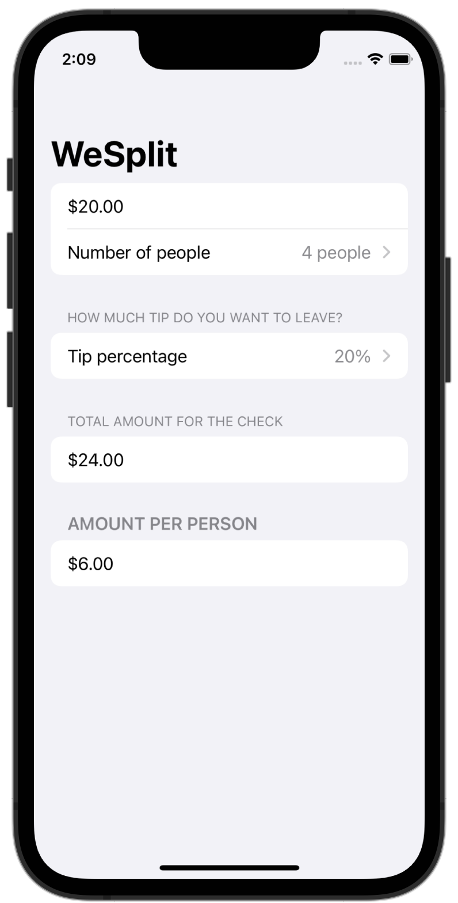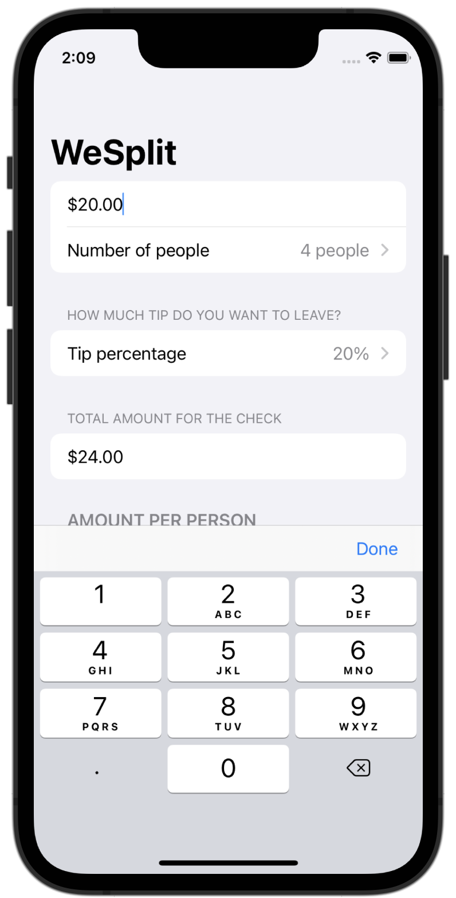|
|19|[Challenge Day 1](day019) UnitConverter|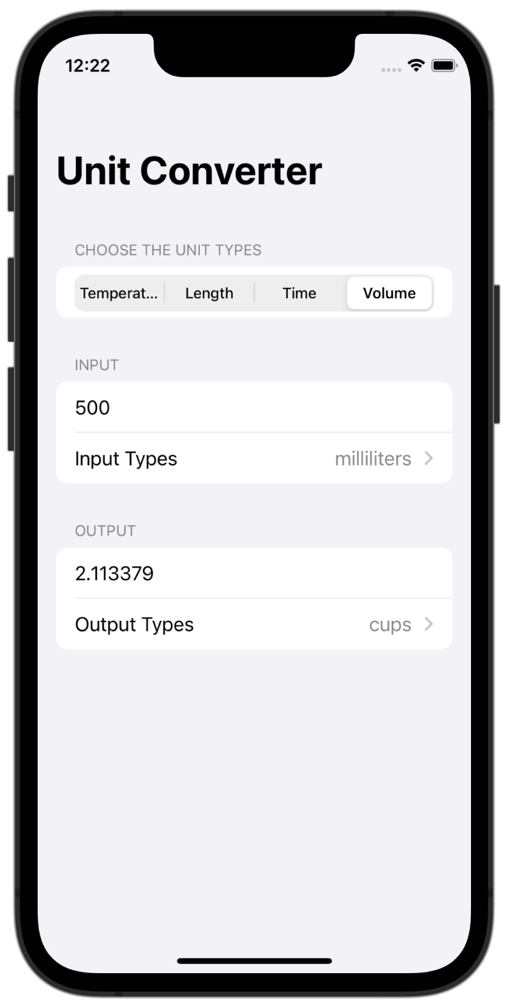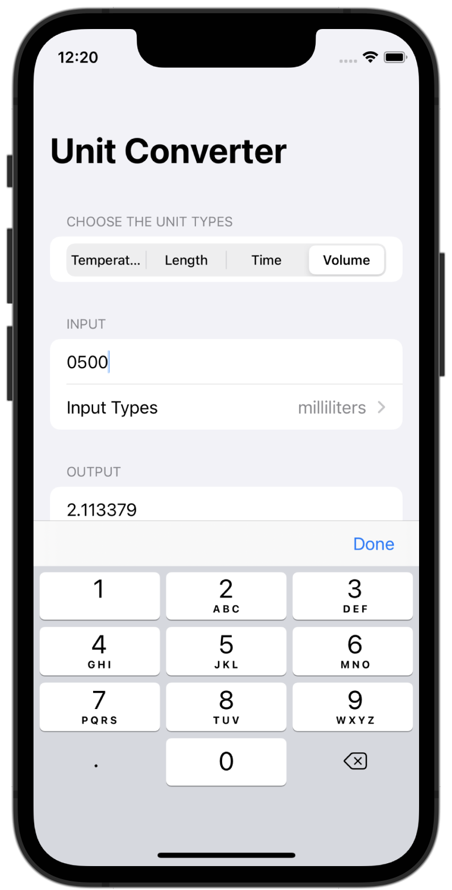|
|20-22|[Catch The Flag](day020-022)|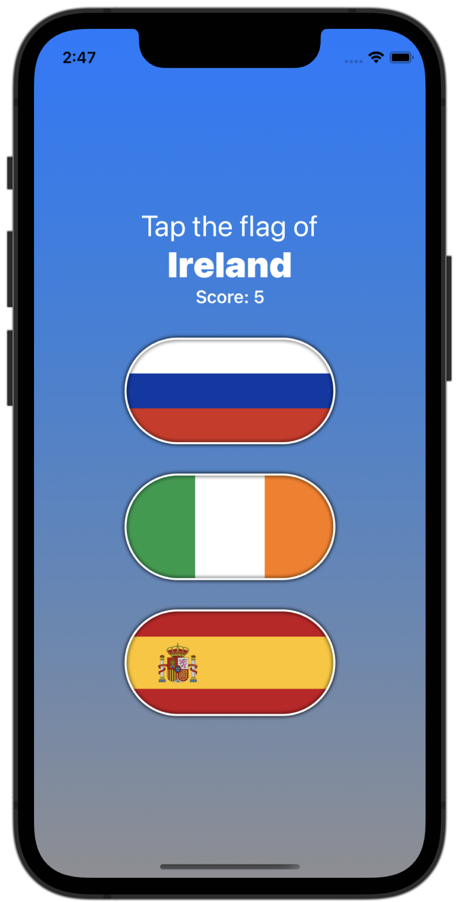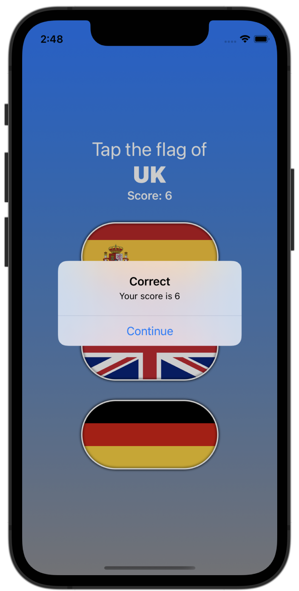|
|23-24|[View and Modifier](day023-024)|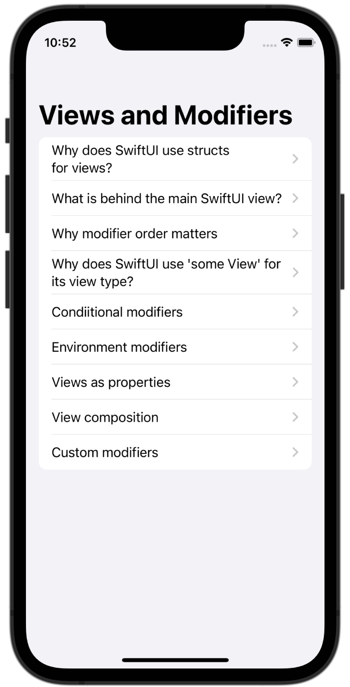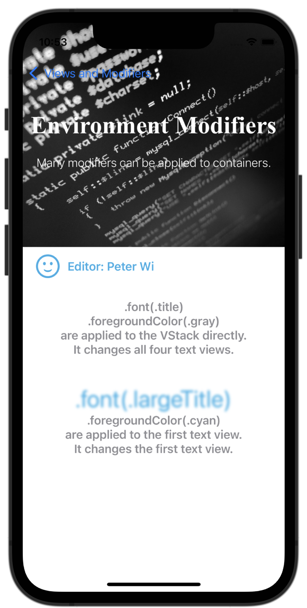|
|25|[Rock Paper Scissors](day025)|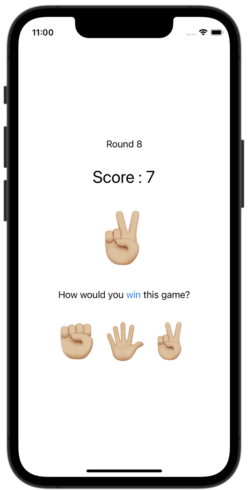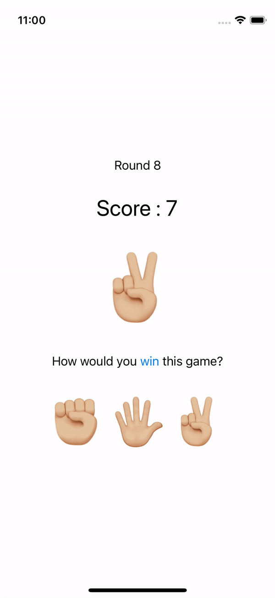|
|26-28|[Better Rest](day026-028)|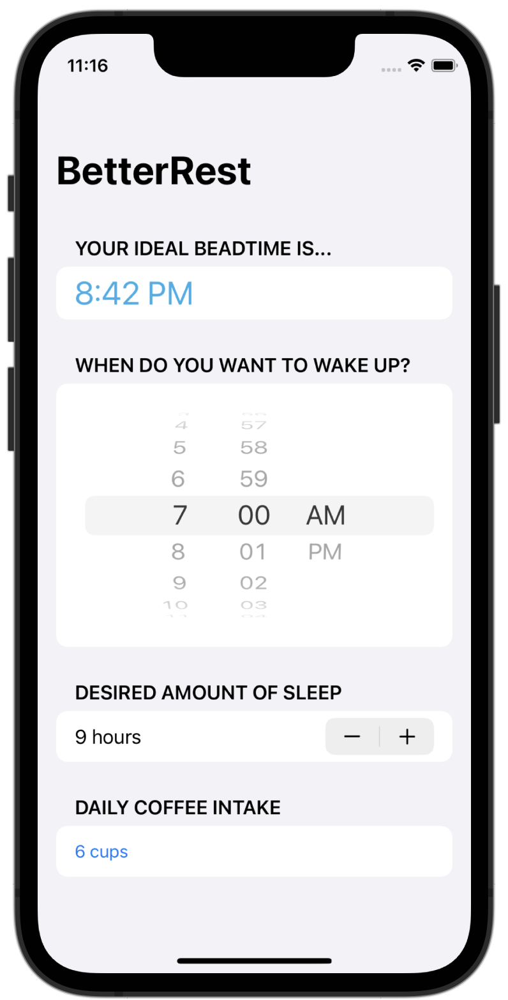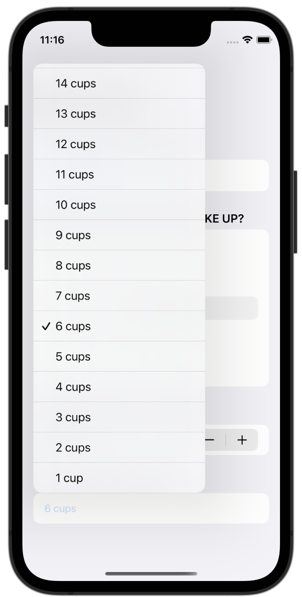|
|29-31|[Word Scramble](day029-031)|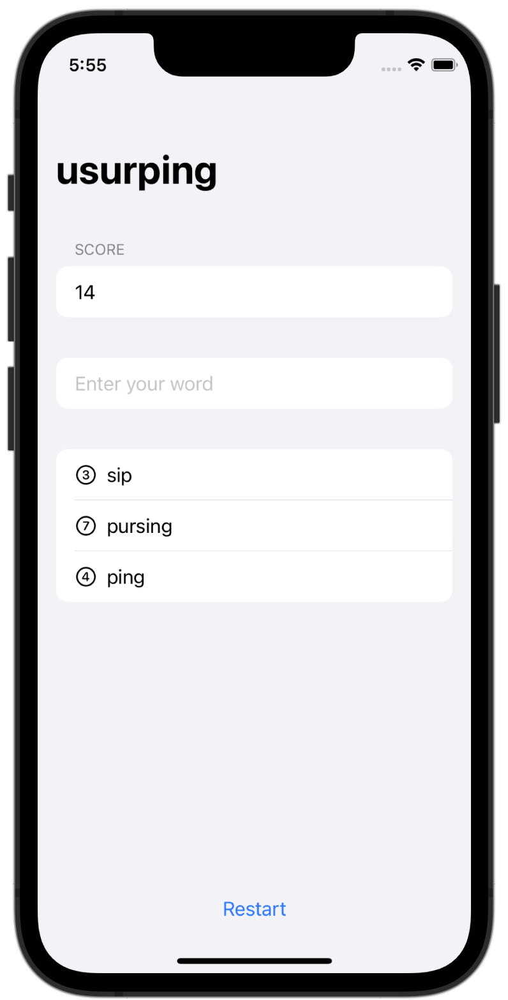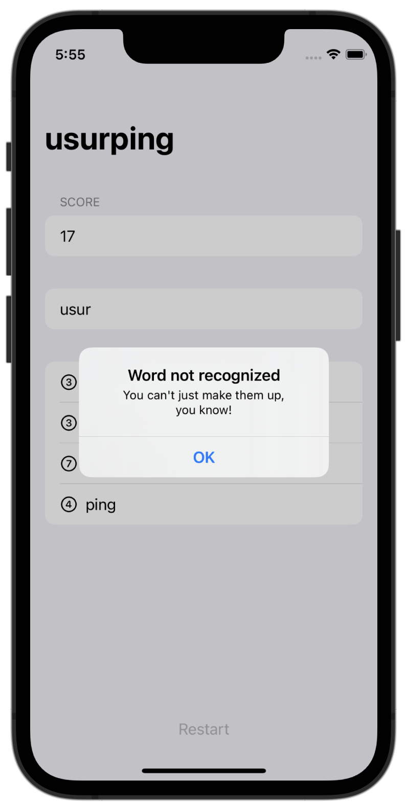|
|32-34|[Animations](day032-034)|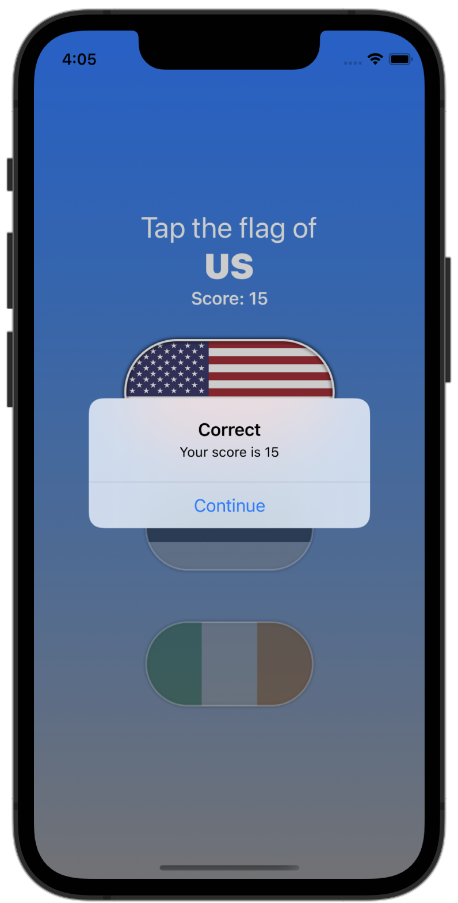|

